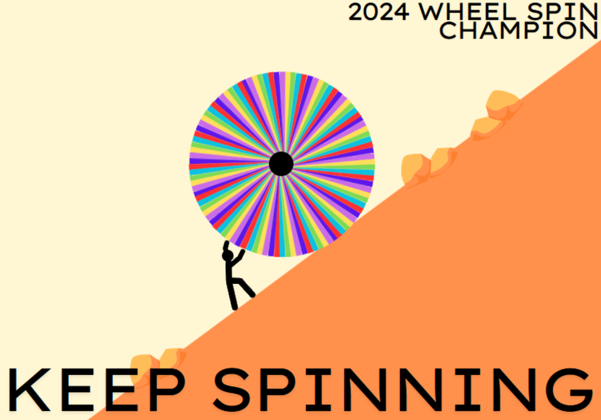
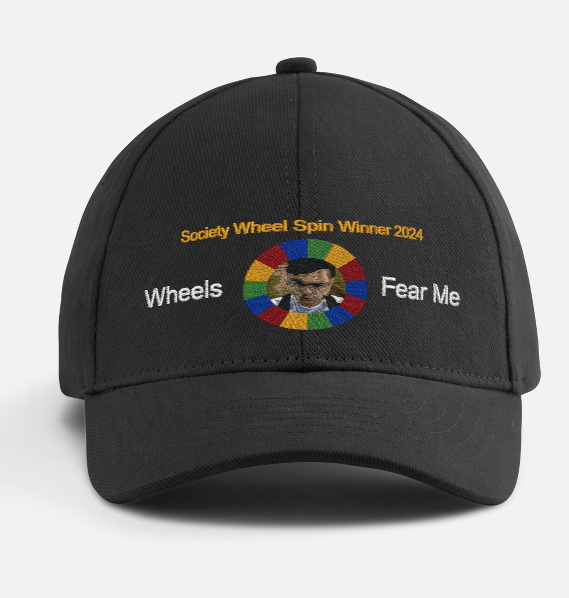
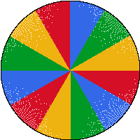

# The Weekly Wheel Bot

*Image courtesy of Blitzar*

---

#### Invite Link
[Invite Weekly Wheel Bot to your server today!](https://discord.com/oauth2/authorize?client_id=1389437484940918815&permissions=2048&integration_type=0&scope=bot)
## What is it?

`Weekly Wheel` is a Discord bot that allows your users to guess a number between 1 and 1000, and regularly spin a wheel to see if they got their number!

---

## Why does it exist?

Our Discord server wanted something to do regularly to keep people active, so we thought the most trivial thing would be to have people guess a random number and spin a wheel every week until it lands on their guess!

The winner would get one of the following:

1. A trophy that says: `Winner of the Society Wheel Spin`
2. A T-shirt that says: `I won the Society Wheel Spin and all I got was this lousy shirt`
3. Or A hat that says:

   > Let any number that meets my spin know the true meaning of chance, for I am the harbinger of wheels, the bane of integers, my spinning is rotational. As I cast my decimal into the revolving abyss, a player, devoid of an unending turn, finds solace in the count. Spinning, whirling, struggling to impede, the arithmetic futileness, that saturates this barren wheel. I am alone. I am empty, and yet, I spin.

Unfortunately the text did not fit on the hat, so we ended up with this:

In 2024, and after over 2 years of spinning, we eventually had a winner! We are currently spinning for second place \:)

 So In order to make our lives easier, I created this bot, and to allow others to do the same.

---

## Features

- Utilises a Google Firestore Database to store guild information including:
  - The guess of each user
  - All numbers rolled that have been rolled
  - The most recent number rolled
- Automatically generated gifs that show what number was rolled!
- I use `.env` files and didn't push my APIKey :)

### Commands

| Command         | Description                                                        | Options                                                                                                                        |
|----------------|--------------------------------------------------------------------|-------------------------------------------------------------------------------------------------------------------------------|
| `/guess`       | Register your guess between 1 and 1000                             | `guess` (integer, required): 1-1000, `guesser` (string, optional): Discord mention, defaults to user                        |
| `/roll`        | Manually roll a number between 1 and 1000                          | None                                                                                                                          |
| `/lastroll`    | Get the last number that was rolled in this server                 | None                                                                                                                          |
| `/allrolled`   | Get a list of all numbers rolled in this server                    | None                                                                                                                          |
| `/scheduleroll`| Schedule what date and time the number should be rolled (weekly)   | `day` (string, required): Day to start, `time` (string, required): Time to start (24HH)                                        |
| `/uploadrolls` | Upload a txt file of all previous rolls (overrides previous rolls) | `file` (attachment, required): .txt file, one roll number per line                                                           |

---

## Future Features

- Scheduling of wheel spins
- Further user and guess validation to avoid guess duplication, and users from guessing a number that has already been rolled
- Custom GIFs?????